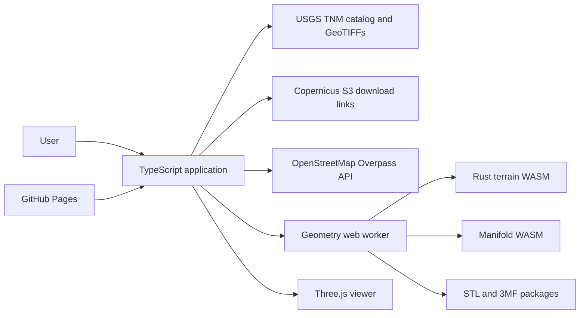

# Contour Workbench architecture

Status: implemented architecture, October 2026.

## Purpose

Contour Workbench is a static, client-side application for designing printable terrain models. It combines elevation rasters and map features, previews the effective design in Three.js, and creates validated terrain, insert, and carved geometry without a backend.

The browser is the trust boundary for uploaded files and downloaded models. Remote services provide source data only; project editing and mesh generation stay on the user's device.

## System context

GitHub Pages serves HTML, JavaScript, WebAssembly, screenshots, and preset packs. There is no runtime application server.

## Components

### Rust geometry core

`crates/terrain-core` owns rules that must be deterministic and portable:

- Settings and geographic bounds validation.
- Elevation-grid sampling and geographic-to-model layout.
- OSM and GeoJSON classification and normalization.
- Full-resolution and adaptive terrain triangulation.
- Polygon clipping for arbitrary terrain extents.
- Preview overlays, V-carve geometry, insert prisms, pockets, and zone floors.
- Removal of enclosed terrain pins below the nozzle-derived printable width.
- Copernicus tile URL and Overpass query construction.
- Closed, consistently oriented mesh validation.

Geographic positions are `[longitude, latitude]` in decimal degrees. Elevations are meters at the source boundary. Generated model coordinates and print settings are millimeters unless a name explicitly ends in `_m` or `_deg`.

### WASM boundary

`crates/terrain-wasm` exposes a `TerrainSession`. The session parses, validates, and retains one elevation grid. Terrain, overlay, and plan calls send only changing settings, features, and layout data.

Geometry crosses the boundary in a versioned `CWB1` binary packet:

1. Four-byte magic value.
2. Little-endian metadata byte length and mesh count.
3. Position and index counts for every mesh.
4. UTF-8 JSON metadata.
5. Padding to a four-byte boundary.
6. Per-mesh `f32` XYZ positions followed by `u32` triangle indices.

The TypeScript decoder returns typed-array views over the packet when alignment allows. This avoids large JSON number arrays and repeated elevation-grid parsing.

### Browser application

`web/src/main.ts` composes the UI, project state, persistence, source loading, and worker requests. Supporting modules isolate major browser responsibilities:

- `app-shell.ts`: static controls, dialogs, and viewport hosts.
- `providers.ts` and `provider-registry.ts`: raster windows and mosaics, provider selection, USGS/Copernicus catalogs, persistent response caching, and bounded Overpass mirror failover.
- `extent-map.ts` and `extent-shapes.ts`: slippy-map drawing and editable shapes.
- `viewer.ts`: Three.js terrain, feature overlays, topographic ground imagery, selection, and review.
- `annotation-editor.ts` and `annotations.ts`: text/PNG authoring and printable geometry.
- `presets.ts`: static landing catalog and prebuilt mesh packs.
- `three-mf.ts` and `three-mf-validation.ts`: portable/Bambu packages plus mesh, OPC-part, XML, identifier, and build-reference validation.
- `project-files.ts`: filesystem-safe project names, browser downloads, and upload limits.
- `engine-contract.ts` and `client.ts`: a discriminated request/result map, structured progress, and request cancellation for the geometry worker.
- `persistent-cache.ts`: IndexedDB storage with an in-memory fallback and expiration policy.
- `serialized-contract.ts`: compile-time TypeScript parity with the Rust serialization manifest.

A saved schema-version-2 project contains the elevation grid, provenance, features, annotations, editable extent state, and print settings. It does not depend on a service remaining available after save.

GeoTIFF, Manifold, and 3MF modules are dynamically imported at their first use. The landing and preset-editing path therefore avoids parsing those heavy implementations until a user downloads terrain, generates printable geometry, or exports 3MF.

### Geometry worker

`web/src/worker.ts` keeps expensive and WASM-backed work off the UI thread. It owns:

- The persistent Rust `TerrainSession`.
- The current terrain mesh and settings.
- A cached base Manifold solid.
- Manifold boolean operations and explicit object deletion through `manifold-adapter.ts`.
- Watertight export validation and bounded repair attempts.
- Cooperative cancellation checkpoints between Boolean groups, annotations, and insert operations, with forced worker replacement if native WASM work does not yield promptly.
- STL bundles, calibration geometry, preset packs, and generation results.

Changing visibility, treatment, width, or carve depth rebuilds overlays or the final plan without rebuilding terrain. Base-thickness edits shift cached terrain vertices and invalidate only the Manifold solid. A new grid or terrain build invalidates the Rust session and cached solid.

The worker retains its terrain buffer. Responses that cross the worker boundary receive a copy, because transferring the retained buffer would detach it and corrupt later generation. Worker requests and responses are exhaustively typed by operation; adding an operation requires updating the shared map rather than passing an untyped string and payload.

### Manifold compatibility

Manifold performs final solid unions, differences, intersections, taper layers, and annotation booleans. The project pins `manifold-3d` 3.4.1. Version 3.5.4 produced a small number of multiply shared edges in the Mt. Hood Meadows result under the project's strict validator, so upgrades require both preset generation tests before changing the pin.

Manifold mesh exports include merge vectors. The worker resolves that topology before coordinate welding and watertightness checks. Temporary Manifold and CrossSection objects must be deleted in every success and failure path.

## Data flows

### New project

1. The user draws or edits a geographic boundary.
2. Source policy estimates raster sample count and chooses 10 m, 30 m, or 90 m data for Auto.
3. The browser checks IndexedDB for the exact product and bounds before resolving or downloading tiles.
4. The provider registry loads USGS data directly where available. Copernicus supplies direct URLs or download links; local GeoTIFF import remains available when source CORS policy blocks a request.
5. The UI asks Overpass for supported paths and zones. Transient failures retry through a bounded mirror list, and successful responses are cached for one day.
6. Rust normalizes classifications and builds terrain and preview overlays.
7. Three.js displays the effective design while feature controls remain editable.

### Preset project

1. The landing catalog loads a compressed `.cwpack`.
2. The app displays its prebuilt terrain and overlays immediately.
3. Overlay identifiers are checked against project feature identifiers.
4. The worker hydrates a Rust session in the background for subsequent edits and generation.

### Printable generation

1. Rust builds insert pieces and ordered cutter groups.
2. The worker imports or reuses the base Manifold terrain.
3. It applies grouped pockets and V-carves, conformal intersections, insert taper, annotations, and porches.
4. Each output mesh is welded and checked for finite, nondegenerate, closed, consistently oriented topology.
5. The UI enters Review mode with a validated terrain and linked insert pieces.

### Download

- STL creates a ZIP with terrain and insert files, project data, origins, validation, attribution, and the calibration coupon.
- Portable 3MF places terrain and inserts in assembly coordinates.
- Bambu 3MF puts terrain on plate one, shelf-packs inserts onto later configured-bed plates, and includes nozzle-derived process hints without binding to a printer or filament profile.
- Both 3MF variants validate mesh indices, required OPC parts, XML syntax, core namespace/units, object identifiers, and build references before the archive is returned.

## Source and geometry constraints

- Geographic bounds are limited to two degrees per side, latitude ±85 degrees, and two million elevation samples.
- Only geographic WGS84/NAD83 GeoTIFFs are accepted.
- Auto targets at most one million samples: USGS 10 m for small US areas, 30 m for larger areas, and Copernicus 90 m for giant areas.
- Overpass availability and coverage can vary. The registry retries transient failures across two mirrors; permanent request errors are reported immediately. OSM multipolygon holes are retained.
- Elevation results are cached for 30 days and OSM responses for one day. IndexedDB failures degrade to normal uncached requests.
- Preview overlays communicate effective placement but final boolean fit is calculated during Generate.
- Large inserts retain a configurable terrain floor. Inserts remain continuous unless segmentation is explicitly enabled.
- Watertight validation is a topology guarantee, not a printer or material guarantee.

## Tests and deployment

`scripts/check.sh` installs web dependencies once, then runs Rust formatting, strict Clippy, Rust tests, Prettier verification, TypeScript checking, Vitest, the WASM build, and the production Vite build. `scripts/build-wasm.sh` owns binding generation so CI and local checks do not repeat dependency installation or TypeScript checking.

Playwright mobile tests cover the landing flow, responsive settings, feature controls, shape settings and persistence, annotations, 3MF download choices, and repeated generation. Preset tests build Post Canyon, Mt. Hood Meadows, and the switchback calibration coupon, catching geometry-lifetime and watertightness regressions.

`.github/workflows/validate.yml` runs the complete validation suite for pull requests without deployment. `.github/workflows/contour-pages.yml` repeats the release gate on pushes to `main`, uploads `web/dist`, and deploys it through GitHub Pages. Both workflows can also be run manually.

Rust unit tests serialize every shared core model and compare its field names and enum values with `web/src/serialized-contract.json`. TypeScript compile-time checks and Vitest compare that JSON with the literal TypeScript manifest, making field drift fail CI on either side.
