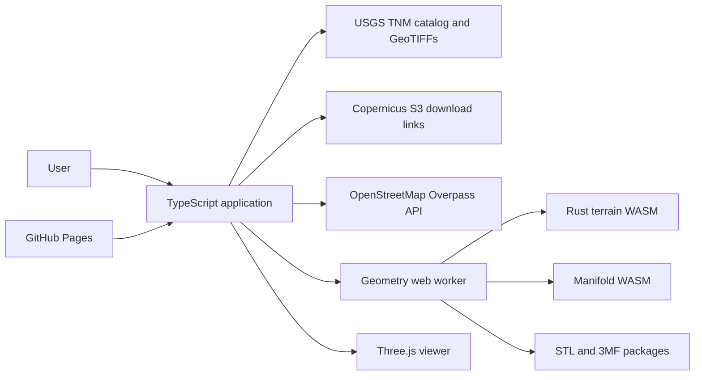

# Contour Workbench architecture

Status: implemented architecture, October 2026.

## Purpose

Contour Workbench is a static, client-side application for designing printable terrain models. It combines elevation rasters and map features, previews the effective design in Three.js, and creates validated terrain, insert, and carved geometry without a backend.

The browser is the trust boundary for uploaded files and downloaded models. Remote services provide source data only; project editing and mesh generation stay on the user's device.

## System context

GitHub Pages serves HTML, JavaScript, WebAssembly, screenshots, and preset packs. There is no runtime application server.

## Components

### Rust geometry core

`crates/terrain-core` owns rules that must be deterministic and portable:

- Settings and geographic bounds validation.
- Elevation-grid sampling and geographic-to-model layout.
- OSM and GeoJSON classification and normalization.
- Full-resolution and adaptive terrain triangulation. Full-detail grid faces are emitted in 128 by 128-cell tiles that share global seam vertices; adaptive builds skip allocating the obsolete full-detail face list.
- Polygon clipping for arbitrary terrain extents.
- Preview overlays, V-carve geometry, separate insert prisms, and direct feature-aware pocket and zone-floor surfaces.
- Removal of enclosed terrain pins below the nozzle-derived printable width.
- Copernicus tile URL and Overpass query construction.
- Closed, consistently oriented mesh validation.

Geographic positions are `[longitude, latitude]` in decimal degrees. Elevations are meters at the source boundary. Generated model coordinates and print settings are millimeters unless a name explicitly ends in `_m` or `_deg`.

### WASM boundary

`crates/terrain-wasm` exposes a `TerrainSession`. The session parses, validates, and retains one elevation grid. Terrain, overlay, and plan calls send only changing settings, features, and layout data.

Geometry crosses the boundary in a versioned `CWB1` binary packet:

1. Four-byte magic value.
2. Little-endian metadata byte length and mesh count.
3. Position and index counts for every mesh.
4. UTF-8 JSON metadata.
5. Padding to a four-byte boundary.
6. Per-mesh `f32` XYZ positions followed by `u32` triangle indices.

The TypeScript decoder returns typed-array views over the packet when alignment allows. This avoids large JSON number arrays and repeated elevation-grid parsing. Printable plans stay in the Rust session. The worker first takes ownership of the final planned terrain mesh, then pulls bounded V-carve packets and insert packets. Every take operation replaces the Rust vectors with empty vectors before encoding, so source allocations are released as soon as ownership crosses the boundary instead of remaining duplicated in the pending plan.

### Browser application

`web/src/main.ts` composes the UI, project state, persistence, source loading, and worker requests. Supporting modules isolate major browser responsibilities:

- `app-shell.ts`: static controls, dialogs, and viewport hosts.
- `providers.ts` and `provider-registry.ts`: raster windows and mosaics, provider selection, USGS/Copernicus catalogs, persistent response caching, and bounded Overpass mirror failover.
- `extent-map.ts` and `extent-shapes.ts`: slippy-map drawing and editable shapes.
- `viewer.ts`: Three.js terrain, feature overlays, topographic ground imagery, selection, and review.
- `annotation-editor.ts` and `annotations.ts`: text/PNG authoring and printable geometry.
- `presets.ts`: static landing catalog and prebuilt mesh packs.
- `three-mf.ts` and `three-mf-validation.ts`: portable, Bambu Studio, PrusaSlicer, and service 3MF packages plus mesh, OPC-part, XML, identifier, and build-reference validation.
- `export-client.ts`, `export-worker.ts`, and `export-formats.ts`: one disposable final-export worker, compact transferable mesh copies, target-specific encoding, and strict worker termination.
- `project-files.ts`: filesystem-safe project names, browser downloads, and upload limits.
- `engine-contract.ts` and `client.ts`: a discriminated request/result map, structured progress, and request cancellation for the geometry worker.
- `persistent-cache.ts`: IndexedDB source-data caching with an in-memory fallback and expiration policy.
- `project-store.ts`: durable local project metadata, state, terrain, and generated thumbnails.
- `serialized-contract.ts`: compile-time TypeScript parity with the Rust serialization manifest.

A saved schema-version-2 project contains the elevation grid, provenance, features, annotations, editable extent state, and print settings. It does not depend on a service remaining available after save. Editable file export uses this same schema; local projects split the state and elevation records so frequent edits do not rewrite the large raster.

The viewer computes a standard presentation pose from the highest surface vertex. It places that point toward the back of the scene and frames the terrain from an oblique elevation. Thumbnail rendering uses the same pose in an offscreen render target, without moving the user's active camera.

GeoTIFF, Manifold, and 3MF modules are dynamically imported at their first use. The landing and preset-editing path therefore avoids parsing those heavy implementations until a user downloads terrain, generates printable geometry, or exports 3MF.

### Geometry worker

`web/src/worker.ts` keeps expensive and WASM-backed work off the UI thread. It owns:

- The persistent Rust `TerrainSession`.
- The current terrain mesh and settings.
- Direct Rust terrain pockets, remaining Manifold operations for V-carves and annotations, streamed insert batches, and explicit object deletion through `manifold-adapter.ts`.
- Full edge validation and bounded repair for independent parts. Large terrain exported directly from a successful Manifold solid receives finite-coordinate and triangle-index validation without allocating a second three-edges-per-triangle table.
- A pre-allocation memory estimate that chooses bounded adaptive terrain detail when automatic full detail would exceed the browser-derived build budget.
- Cooperative cancellation checkpoints between V-carve groups, annotations, and insert operations, with forced worker replacement if native WASM work does not yield promptly.
- Calibration geometry, preset packs, and generation results. Final archive encoding is isolated in a disposable export worker.

Changing visibility, treatment, width, or carve depth rebuilds overlays or the final plan without rebuilding terrain. Base-thickness edits shift cached terrain vertices without rebuilding source terrain. A new grid or terrain build replaces the Rust session.

The worker retains its terrain buffer. Responses that cross the worker boundary receive a copy, because transferring the retained buffer would detach it and corrupt later generation. Worker requests and responses are exhaustively typed by operation; adding an operation requires updating the shared map rather than passing an untyped string and payload.

### Manifold compatibility

Manifold performs final solid unions, differences, intersections, taper layers, and annotation booleans. The project pins `manifold-3d` 3.5.4, and dependency upgrades must pass both preset generation tests before changing the pin.

Manifold mesh exports can contain multiple property vertices for one topological vertex. `manifold-adapter.ts` resolves the merge-vector union relation, compacts referenced vertices into typed arrays, and validates directed edges through a sorted numeric buffer. This avoids the string-key maps and boxed number arrays that previously produced large transient allocations on full-resolution terrain. Native topology is preferred over coordinate welding because distinct vertices may be nearly coincident; bounded coordinate welding remains a fallback for malformed exports.

Insert pockets preserve class priority inside Rust. Equal-height pocket regions are unioned, deeper regions claim overlaps, and a constrained terrain triangulation emits the original surface, pocket floors, shared bottom, outer walls, and vertical feature interfaces as one validated mesh. A deterministic bounding-box sweep routes different-height overlaps or shared boundaries to bounded pocket cutters before constrained triangulation, avoiding a known failed-build path on complex presets. Touching linework for remaining direct pockets is normalized before the full terrain load. If another pathological junction still fails two-manifold validation, Rust emits the established bounded pocket cutters instead of returning unsafe geometry. Feature patches window the elevation grid to local bounds. V-carves remain bounded class-preserving cutter packets because their sloped profiles still use Manifold subtraction. Each transferred terrain, cutter, and insert mesh is removed from the pending Rust plan as its packet is produced.

The working terrain solid is deleted immediately after export; only then is the extra conformal-terrain solid created for insert fitting. Conformal fitting shifts that temporary solid by each piece's effective Proud, Flush, or Inset offset, replacing it when the offset changes so only one shifted copy is retained. For terrain above one million preview triangles, Three.js releases design geometry and keeps the topo surface visible during generation. These lifetime rules reduce the shared WebContent-process peak while preserving class order and Boolean meaning. Temporary Manifold and CrossSection objects must be deleted in every success and failure path.

## Data flows

### New project

1. The user draws or edits a geographic boundary. Rounded corners are tessellated against the final print scale with a 0.05 mm maximum chord error and a bounded vertex budget.
2. The viewer immediately derives the same print-bed layout used by Rust, shows the USGS topo map (OpenTopoMap internationally), and draws the selected boundary while source data loads.
3. Source policy estimates raster sample count and chooses 10 m, 30 m, or 90 m data for Auto. The browser checks IndexedDB before resolving or downloading tiles.
4. As soon as elevation is available, Rust builds terrain and the viewer replaces the flat map footprint with the fitted terrain mesh.
5. The UI then requests supported paths and zones from Overpass. Transient failures retry through a bounded mirror list, and successful responses are cached for one day.
6. Rust normalizes classifications and builds preview overlays. Three.js adds them without rebuilding or hiding the terrain.
7. Feature controls remain editable throughout the completed design preview.

### Preset project

1. The landing catalog loads a compressed `.cwpack`.
2. The app displays its prebuilt terrain immediately, then adds the linked overlays on the following rendered frame.
3. Overlay identifiers are checked against project feature identifiers.
4. The worker hydrates a Rust session in the background for subsequent edits and generation.
5. Opening a preset remains ephemeral. Its first edit forks it into a new local project identifier and starts autosave.

### Local project sessions

1. The first meaningful edit to a preset, or creation/import of a new design, assigns a UUID. Merely viewing a preset creates no local record.
2. A short debounce writes project state and metadata to IndexedDB. The elevation grid has a separate record and is rewritten only when its identity changes.
3. After the scene settles, Three.js renders a 640 × 360 WebP thumbnail from the standard presentation pose. The landing page resolves thumbnail blobs to temporary object URLs.
4. Returning users can open, rename, duplicate, export, or delete recent projects from the landing page. Opening restores the complete saved project and terrain without fetching source services.
5. IndexedDB failures fall back to memory for the current visit. The app requests persistent browser storage after the first local save when the browser exposes that capability.

### Printable generation

1. Before final geometry allocation, the worker estimates the build peak from source samples, preview triangles, and enabled features. Automatic full detail is replaced with a bounded sampled-error target when the estimate exceeds 72 percent of the browser-derived budget; an explicit user detail target is preserved.
2. Rust constructs insert bodies and the final terrain directly. Constrained surface regions share canonical XY interface coordinates, while each top region owns the height needed for terrain, pocket floors, and vertical walls.
3. The worker takes and releases that terrain allocation, then applies remaining V-carve and annotation operations through Manifold. Plans whose direct pocket junctions fail topology validation include bounded fallback pocket cutters in the same streamed cutter path.
4. Rust streams bounded insert packets. Separate mode can taper them; print-together mode keeps exact interface coordinates and zero fit clearance. Conformal intersections use a separately scoped shifted preview-terrain solid.
5. Independent pieces receive full edge validation. The direct terrain is validated by Rust before transfer and Manifold validates any subsequent solid operation.
6. The UI enters Review mode with the terrain and linked insert pieces. The persistent interactive worker retains preview state; final archive encoding uses a separate disposable worker.

### Download

The UI copies generated meshes into compact typed arrays and transfers ownership to a newly created export worker. The worker encodes one selected target, transfers the completed bytes back, and closes. The client also terminates it after success, failure, or cancellation. This keeps archive strings, texture data, and duplicate geometry out of the persistent preview/generation worker.

- STL creates a ZIP with terrain and insert files, project data, origins, validation, and attribution.
- Portable 3MF places terrain and inserts in assembly coordinates.
- Bambu 3MF puts terrain on plate one, shelf-packs inserts onto later configured-bed plates, and includes nozzle-derived process hints without binding to a printer or filament profile.
- Bambu Studio 3MF includes per-part extruder assignments and uses one aligned plate for print-together mode. PrusaSlicer 3MF uses one build object with aligned terrain/feature components and extruder metadata.
- Shapeways full-color export contains exactly OBJ, MTL, PNG texture, and a short README, with watertight and conservative triangle/archive-size guards. Single-material output is available as assembled STL or 3MF.
- 3MF variants validate mesh indices, required OPC parts, XML syntax, core namespace/units, object identifiers, and build references before the archive is returned.

### Remaining scaling boundary

Validated feature-aware insert pockets no longer require full-terrain Manifold subtraction; pathological multi-height junctions use bounded Manifold pocket batches as a correctness fallback. Full-detail grid faces are constructed in seam-sharing tiles, adaptive builds avoid allocating a discarded full-resolution face list, and local feature patches use bounded grid windows. The current serialized terrain is still one global indexed mesh, and V-carves, annotations, conformal fitting, and insert taper still require Manifold. If future source limits grow beyond the current two-million-sample ceiling, the next step is streaming independently validated terrain tile packets into export assembly while retaining the canonical interface and disposable export-worker contracts.

## Source and geometry constraints

- Geographic bounds are limited to two degrees per side, latitude ±85 degrees, and two million elevation samples.
- Only geographic WGS84/NAD83 GeoTIFFs are accepted.
- Auto targets at most one million samples: USGS 10 m for small US areas, 30 m for larger areas, and Copernicus 90 m for giant areas.
- Overpass availability and coverage can vary. The registry retries transient failures across two mirrors; permanent request errors are reported immediately. OSM multipolygon holes are retained.
- Elevation results are cached for 30 days and OSM responses for one day. IndexedDB failures degrade to normal uncached requests.
- Preview overlays communicate effective Proud, Flush, and Inset placement, but final boolean fit is calculated during Generate. Flush uses render-only polygon/depth bias, while Inset uses a render-only surface opening and boundary wall; neither display treatment changes exported coordinates.
- Paths, V-carves, zones, insert pockets, and preview overlays retain the configured model-edge clearance. Insert footprints account for pocket clearance so the terrain margin remains intact after the pocket expands.
- Large inserts retain a configurable terrain floor. Inserts remain continuous unless segmentation is explicitly enabled.
- Watertight validation is a topology guarantee, not a printer or material guarantee.

## Tests and deployment

`scripts/check.sh` installs web dependencies once, then runs Rust formatting, strict Clippy, Rust tests, Prettier verification, TypeScript checking, Vitest, the WASM build, and the production Vite build. `scripts/build-wasm.sh` owns binding generation so CI and local checks do not repeat dependency installation or TypeScript checking.

Playwright mobile tests cover the landing flow, durable local projects and thumbnails, responsive settings, feature controls, shape settings and persistence, annotations, 3MF download choices, and repeated generation. Preset tests build Post Canyon, Mt. Hood Meadows, and the switchback calibration coupon, catching geometry-lifetime and watertightness regressions.

`.github/workflows/validate.yml` runs the complete validation suite for pull requests without deployment. `.github/workflows/contour-pages.yml` repeats the release gate on pushes to `main`, uploads `web/dist`, and deploys it through GitHub Pages. Both workflows can also be run manually.

Rust unit tests serialize every shared core model and compare its field names and enum values with `web/src/serialized-contract.json`. TypeScript compile-time checks and Vitest compare that JSON with the literal TypeScript manifest, making field drift fail CI on either side.
